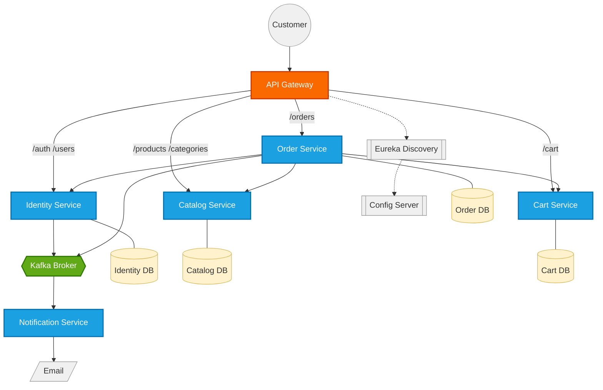

# E-Commerce Microservices

A Spring Boot / Spring Cloud e-commerce backend, converted from a monolith into an event-driven microservices architecture with service discovery, centralized config, an API gateway, and Kafka-based async communication.

---

## Table of Contents

- [Overview](#overview)
- [Tech Stack](#tech-stack)
- [Architecture](#architecture)
- [The Saga Pattern](#the-saga-pattern)
- [Project Structure](#project-structure)
- [Getting Started](#getting-started)
- [API Documentation](#api-documentation)
- [Ports Reference](#ports-reference)
- [Contact](#contact)

---

## Overview

Independently deployable services, each owning its own database. Synchronous REST (Eureka + load-balanced WebClient) for anything needing an immediate answer; Kafka for anything async — emails, notifications.

**Core capabilities:**
- Signup, email verification, login/refresh tokens, role-based access (`CUSTOMER` / `ADMIN`)
- Product catalog with categories, stock, image upload
- Per-user shopping cart
- Checkout with automatic rollback across services if anything fails
- Order lifecycle (`PENDING` → `PAID` / `CANCELLED`)
- Async email notifications via Kafka + SMTP
- Single API Gateway entry point with JWT validation, CORS, routing

---

## Tech Stack

| Concern | Technology |
|---|---|
| Language / runtime | Java 26 |
| Framework | Spring Boot 4.1.1 |
| Cloud tooling | Spring Cloud 2025.1.2 (Gateway, Eureka, Config Server, LoadBalancer) |
| Security | Spring Security + JWT (jjwt) |
| Persistence | Spring Data JPA + MySQL (one DB per service) |
| Messaging | Apache Kafka (KRaft mode) + Spring Kafka |
| Image storage | Cloudinary |
| Build | Maven |

---

## Architecture



Every service registers with **Eureka** and pulls config from **config-server** on startup.

---

## The Saga Pattern

`order-service` orchestrates checkout: it calls `cart-service` and `catalog-service` step by step, and if any step fails, it runs **compensating transactions** to undo whatever already succeeded.

```java
List<CartItemsResponse> decrementedItems = new ArrayList<>();

try {
    for (CartItemsResponse cartItem : cartItems) {
        callUpdateProduct(productId, updatedProduct); // decrement stock
        decrementedItems.add(cartItem);
        // ...save order item...
    }
    // ...clear cart, write outbox event, return...

} catch (Exception ex) {
    for (int i = decrementedItems.size() - 1; i >= 0; i--) {
        CartItemsResponse item = decrementedItems.get(i);
        restoreStock(item.productId(), item.quantity()); // compensate
    }
    throw ex;
}
```

Cancellation restocks the same way, synchronously, in `updateOrderStatus()`.

**Outbox pattern** — the Kafka publish for order confirmation is never sent directly from `checkout()`. Instead, the intent to publish is written to a database table in the *same transaction* as the order:

```java
OrderOutboxEvent outboxEvent = OrderOutboxEvent.builder()
        .orderId(savedOrder.getId())
        .email(email)
        .totalPrice(total)
        .published(false)
        .createdAt(LocalDateTime.now())
        .build();

orderOutboxEventRepository.save(outboxEvent);
```

A scheduled job polls unpublished rows and sends them to Kafka independently:

```java
@Scheduled(fixedDelay = 1000)
public void publishEvents() {
    List<OrderOutboxEvent> events = outboxRepository.findByPublishedFalseOrderByCreatedAtAsc();

    for (OrderOutboxEvent event : events) {
        orderEventProducer.publishOrderPlaced(event.getId(), event.getEmail(), event.getOrderId(), event.getTotalPrice());
        event.setPublished(true);
        event.setPublishedAt(LocalDateTime.now());
        outboxRepository.save(event);
    }
}
```

Order and outbox row commit together — no window where one exists without the other.

---

## Project Structure

```
microservices-ecommerce/
├── services/
│   ├── discovery-server/       # Eureka service registry
│   ├── config-server/          # Centralized config for every service
│   ├── api-gateway/            # Entry point, JWT check, routing, CORS
│   ├── identity-service/       # Auth, users, JWT issuing
│   ├── catalog-service/        # Products, categories, stock
│   ├── cart-service/           # Per-user shopping cart
│   ├── order-service/          # Checkout, order lifecycle, saga orchestration
│   └── notification-service/   # Kafka consumer, sends emails
└── README.md
```

Each service follows the same internal layout:
```
<service>/src/main/java/com/example/<service>/
├── config/          # Security, JWT, WebClient, Kafka config
├── controllers/     # REST endpoints
├── services/        # Business logic
├── repository/      # Spring Data JPA repositories
├── models/          # JPA entities
├── dtos/            # Request/response shapes
├── events/          # Kafka producers/consumers (where applicable)
└── share/           # Response wrapper + exceptions
```

---

## Getting Started

Prerequisites: Java 26, Maven, MySQL, Apache Kafka (KRaft mode).

**Startup order:** `discovery-server` (8761) → `config-server` (8888) → everything else, any order.

All client traffic goes through the gateway: **`http://localhost:8080`**

---

## API Documentation

Every response: `{ "status": "success", "data": {}, "errors": null }`

### identity-service

| Method | Endpoint | Auth | Body / Params |
|---|---|---|---|
| POST | `/auth/signup` | — | `username, email, password` |
| POST | `/auth/login` | — | `username, password` → `[accessToken, refreshToken]` |
| GET | `/auth/verify-email` | — | `?token=` |
| GET | `/auth/resend-verification-email` | — | `?email=` |
| POST | `/auth/refresh-token` | — | raw string body: `"<token>"` |
| GET | `/users/me` | CUSTOMER/ADMIN | → `{username, email, role}` |
| PUT | `/users` | CUSTOMER/ADMIN | `username?, email?` |

### catalog-service

| Method | Endpoint | Auth | Body / Params |
|---|---|---|---|
| POST | `/categories` | ADMIN | `name` |
| GET | `/categories` | CUSTOMER/ADMIN | — |
| PUT | `/categories/{id}` | ADMIN | `name` |
| DELETE | `/categories/{id}` | ADMIN | — |
| POST | `/products` | ADMIN | `name, quantity, price, categoryId` |
| GET | `/products` | CUSTOMER/ADMIN | `?page=&size=` |
| GET | `/products/{id}` | CUSTOMER/ADMIN | — |
| PUT | `/products/{id}` | CUSTOMER/ADMIN | `name?, quantity?, price?, categoryId?` |
| DELETE | `/products/{id}` | ADMIN | — |
| POST | `/products/{id}/upload-image` | ADMIN | `multipart/form-data`, field `image` |

### cart-service

All routes: `CUSTOMER` or `ADMIN`.

| Method | Endpoint | Body / Params |
|---|---|---|
| POST | `/cart/add/{productId}` | — |
| PUT | `/cart/{productId}` | `quantity` |
| GET | `/cart` | — |
| DELETE | `/cart/remove/{productId}` | — |
| DELETE | `/cart` | — |

### order-service

| Method | Endpoint | Auth | Body / Params |
|---|---|---|---|
| POST | `/orders/checkout` | CUSTOMER/ADMIN | — |
| GET | `/orders` | CUSTOMER/ADMIN | own orders only |
| GET | `/orders/{id}/items` | CUSTOMER/ADMIN | — |
| GET | `/orders/all` | ADMIN | — |
| PATCH | `/orders/{id}/status` | ADMIN | `status: PAID \| CANCELLED` |

---

## Ports Reference

| Service | Port |
|---|---|
| discovery-server | 8761 |
| config-server | 8888 |
| api-gateway | 8080 |
| identity-service | 8081 |
| catalog-service | 8082 |
| cart-service | 8083 |
| order-service | 8084 |
| notification-service | 8085 |
